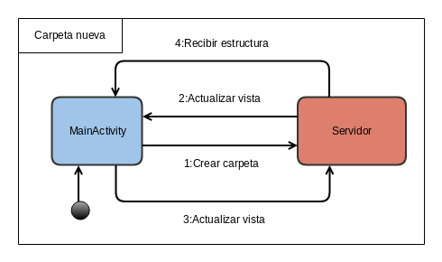
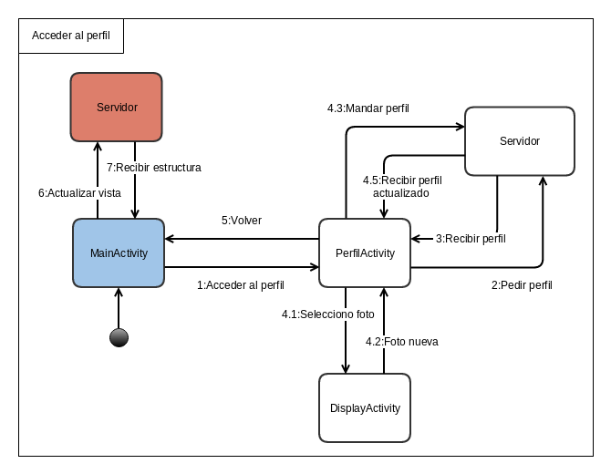
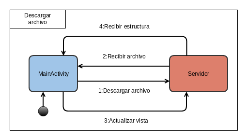
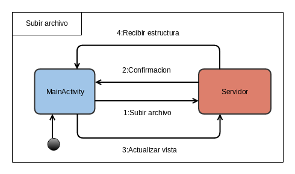
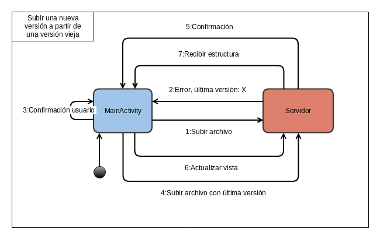
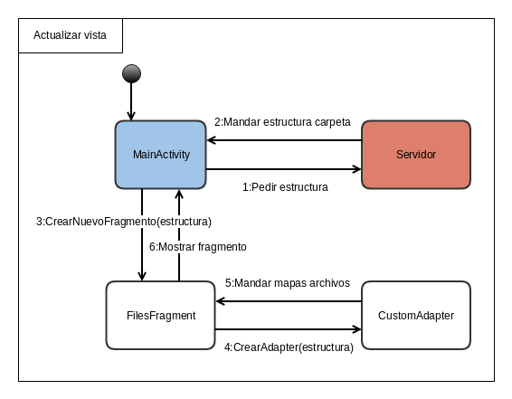

Documentacion de la arquitectura y diseño
=========================================

Para dieseñar y desarrollar la aplicación, nos basamos principalmente en el diseño y funcionamiento de otras aplicaciones similares, que se encargan de subir, descargar y compartir archivos.

Además usamos los principios de diseño presentados por `Android <http://developer.android.com/intl/es/design/index.html>`_.

La aplicación esta formada por diversas Activities, las cuales representan a cada ventana diferente de la aplicación.

Hay Activities triviales, como las de ElegirSesionActivity, IniciarSesionActivity y RegistrarseActivity que no tienen mucha lógica implementada, por lo cual pasaremos a explicar la implementación y diseño de la MainActivity, la cual es la mas importante.

MainActivity
-------------------------------------------------------------------

Es la Activity principal que se encarga de la mayoría de las tareas es la MainActivity.

Permite:

 + Obtener la estructura interna de una carpeta y crear un fragmento para que la muestre.
 + Sube y descarga archivos.
 + Descarga versiones anteriores de los archivos y avisa en caso de querer subir un archivo luego de haber descargado una version antigua.
 + Crea nuevas carpetas.
 + Elimina archivos y carpetas.
 + Accede a la papelera, desde la cual se pueden eliminar y restaurar archivos.
 + Accede a los archivos compartidos conmigo y permite actualizarlos, además de todas las opciones clasicas de una carpeta normal.
 + Accede a los metadatos de un archivo.
 + Accede al perfil de un usuario.
 + Cierra sesión.

Debido a que cada Activity funciona practicamente por si sola, la mejor forma de mostrar la arquitectura e implementación de la aplicación es con Diagramas de estados, mostrando como se comunican las distintas Activities entre ellas y con el servidor.

	Diagrama de estados para crear una carpeta nueva.

	Diagrama de estados para acceder y actualizar el perfil.

.. figure:: _static/acceder_metadatos.png
	:scale: 75%
	:align: center

	Diagrama de estados para acceder y actualizar los metadatos.

	Diagrama de estados para descargar un archivo.

	Diagrama de estados para subir un archivo.

	Diagrama de estados para subir una versión nueva de un archivo, luego de haber descargado una versión anterior.

	
	Diagrama de estados para actualizar la vista de la estructura interna de una carpeta.

