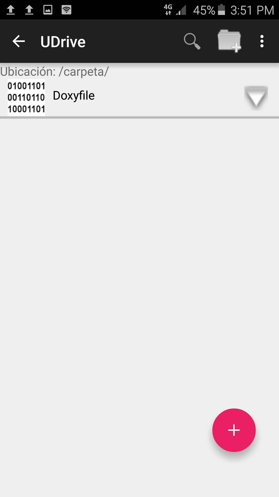
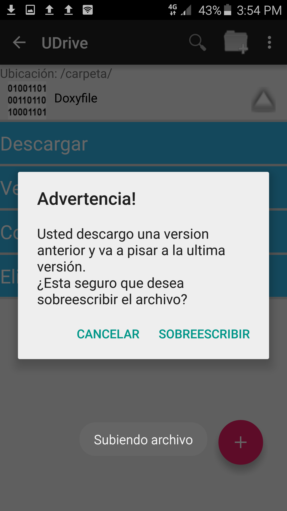
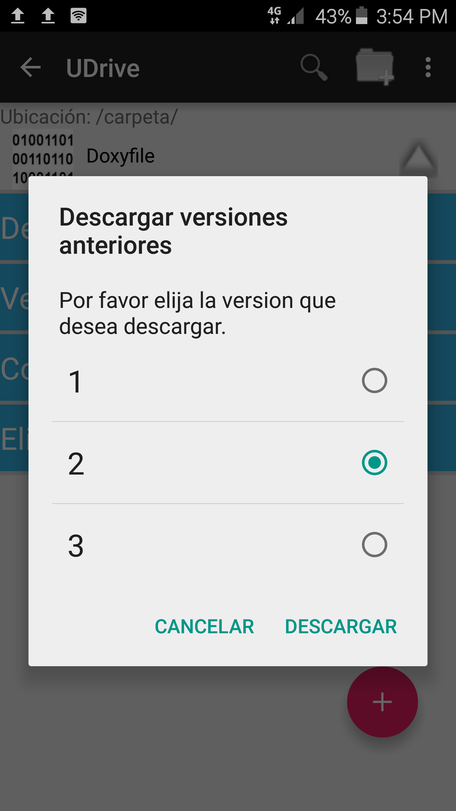

Archivos y carpetas
==========================================

Dentro de su carpeta de **UDrive**, usted puede almacenar tanto archivos como carpetas. Los archivos se pueden compartir, pero las carpetas no. Puede ver más detalles de estos casos en la sección de `compartidos <compartidos.html>`_.

Creación de carpetas
------------------------
Para crear una carpeta, usted dispone del ícono de la carpeta en la esquina superior derecha. Allí podrá ponerle el nombre que usted desee a la misma.

Eliminación de carpetas
------------------------
Usted puede eliminar una carpeta mediante la flecha que se encuentra a la derecha de la misma. El eliminar una carpeta implica la eliminación de todos los archivos que se encuentren dentro de la misma.

Acciones sobre archivos
------------------------
Desplegando la flecha sobre la derecha del archivo se pueden ver las acciones que se pueden realizar sobre el mismo.

.. figure:: _static/archivos_y_carpetas/2.png
	:scale: 20
	:align: center

Entre estas opciones podemos ver que se puede:

 * `Descargar archivos`_
 * `Descargar versiones anteriores`_
 * `Compartir archivos`_
 * `Eliminar archivos`_

Subir archivos
^^^^^^^^^^^^^^^^^^^^^
Usted puede subir archivos de dos maneras:

 * Mediante el botón flotante rosa con el signo más de la parte inferior derecha
 * Seleccionando el botón desplegable de la esquina superior derecha y eligiendo "Subir archivos"

Una vez seleccionado alguno de estos dos métodos, se selecciona el archivo dentro del teléfono y se realiza la subida de archivos:

	Así queda la raíz al subir un archivos en la misma.

Subiendo un archivo con el mismo nombre de un archivo existente se irán generando distintas versiones del mismo. Al querer realizar dicha acción, podría surgir el siguiente inconveniente:

Esto puede suceder debido a que usted se descargó una versión que no se corresponde con la última que existe, por lo que podrá seleccionar para forzar la subida de todas formas.

Descargar
^^^^^^^^^^^^
Descargar archivos
~~~~~~~~~~~~~~~~~~~~~~
El descargar un archivo implica descargar la última versión del mismo. Éste se descargará en una de las carpetas del teléfono.

Descargar versiones anteriores
~~~~~~~~~~~~~~~~~~~~~~~~~~~~~~~~
Al tocar "Versiones anteriores", usted podrá ver un menú con todas las versiones disponibles del archivo. Al seleccionar una de ellas, se descargará el mismo en una de las carpetas del teléfono.

Compartir archivos
^^^^^^^^^^^^^^^^^^^^
Se pueden compartir archivos a distintos usuarios que se hayan registrado alguna vez en la aplicación. Para ver más en profundidad este inciso, ver la sección de `archivos compartidos <compartidos.html>`_.

Eliminar archivos
^^^^^^^^^^^^^^^^^^^^
Al seleccionar la opción "Eliminar" de un archivo se verá que dicho archivo desaparece de la carpeta donde se está parado. Éste no es eliminado definitivamente sino que pasa a una sección de papelera. Para ver más en profundidad esta acción, ver la sección de `papelera <papelera.html>`_.