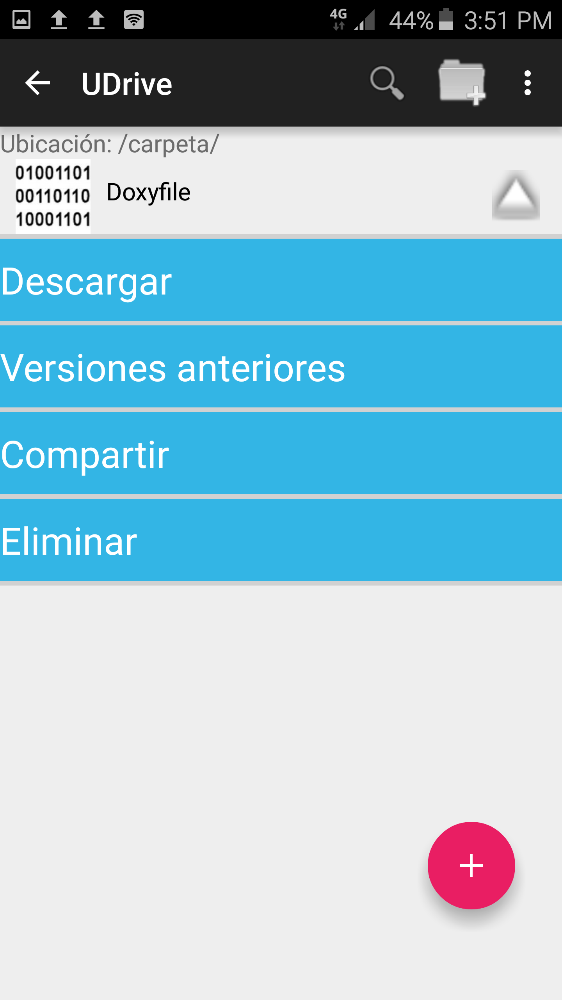
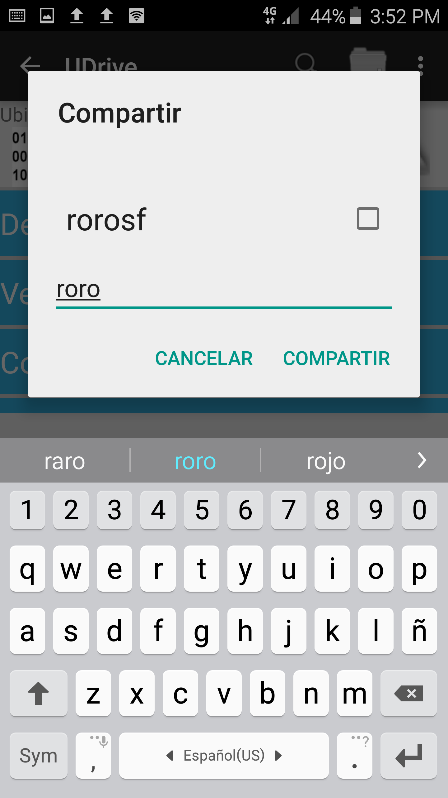
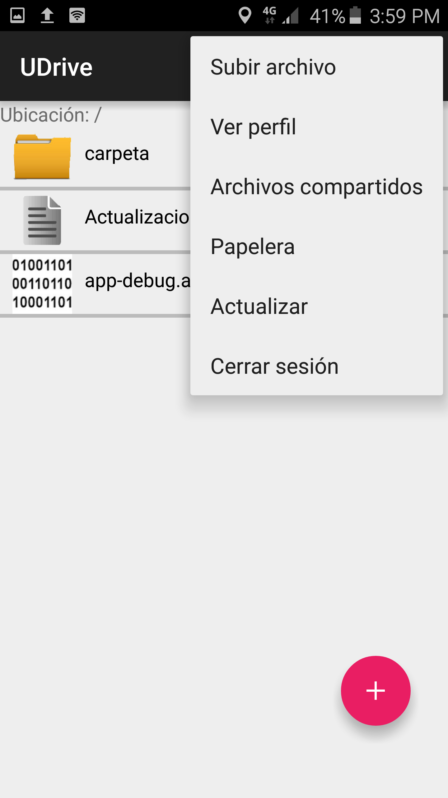
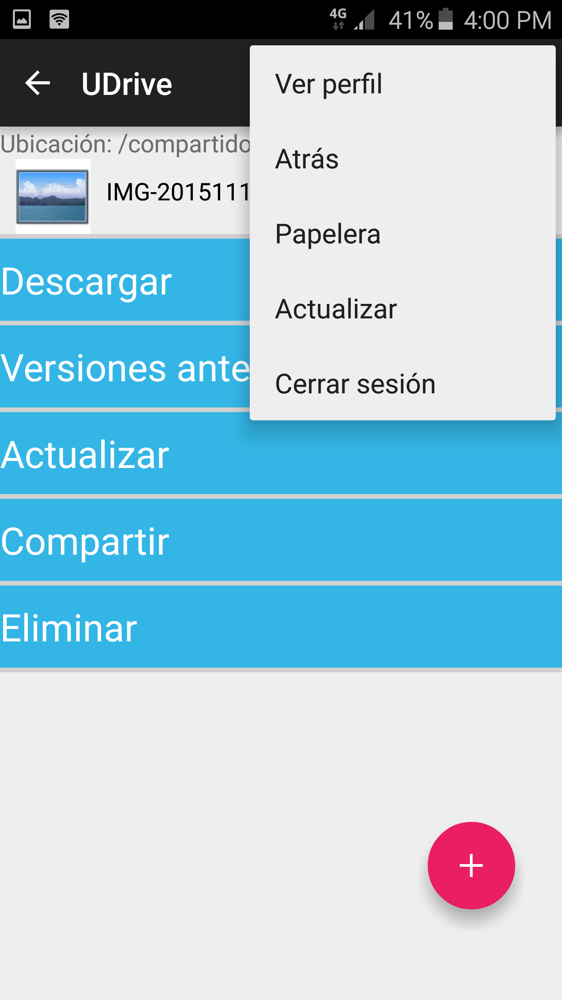

Archivos compartidos
==========================================

Otra de las funcionalidades que ofrece **UDrive** es el compartido de archivos, ésto quiere decir que se podrá tanto compartir archivos a otros usuarios como que otros usuarios puedan compartirme archivos.

Para poder compartir un archivo hay qur ir al menú del mismo y seleccionar la opción *Compartir*.

Una vez seleccionada esta opción se desplegará un cuadro donde se podrá elegir al usuario con el que se quiere compartir el archivo. A medida que se vaya escribiendo algun nombre de usuario aparecerá una lista con todos los que coincidan con el nombre ingresado. Finalmente se deberá seleccionar al usuario con el que se quiere compartir y oprimir el botón *Compartir*.

En el caso de que se quiera descompartir un archivo, en la misma lista desplegable tendrá que deseleccionar al usuario que ya no se le quiera compartir el mismo.

Para poder ver los archivos que me fueron compartidos hay que ir al menú desplegable y seleccionar la opción *Archivos compartidos*.

Una vez ahí se podrá ver la lista de los archivos que me fueron compartidos y se podrá realizar cualquier acción sobre el mismos. Lo único que no se podrá realizar en esta carpeta es subir archivos nuevo sino que solo se podrán actualizar los archivos que se encuentren en ella. Para realizar la actualización hay que seleccionar la opción *Actualizar* del menú desplegable del archivo.

