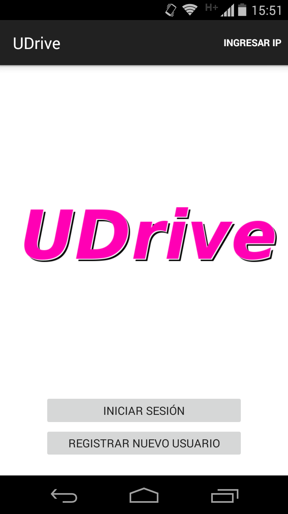
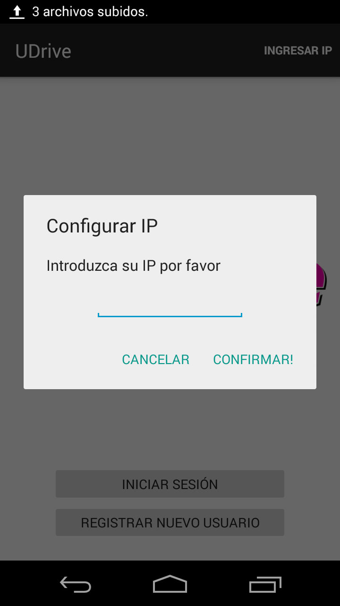
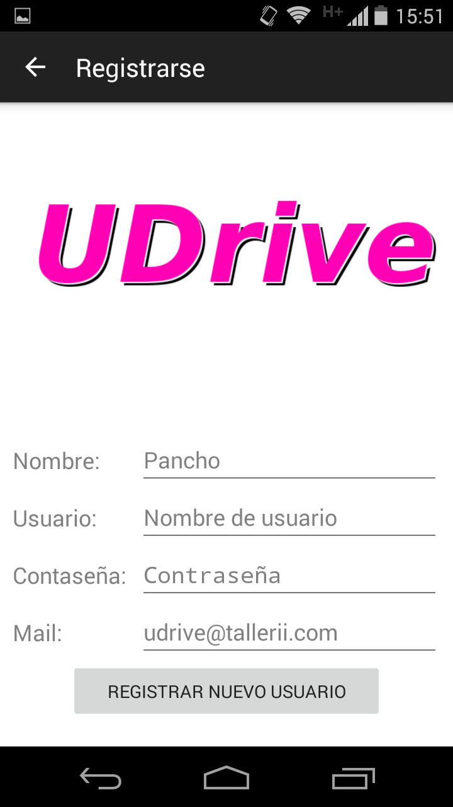
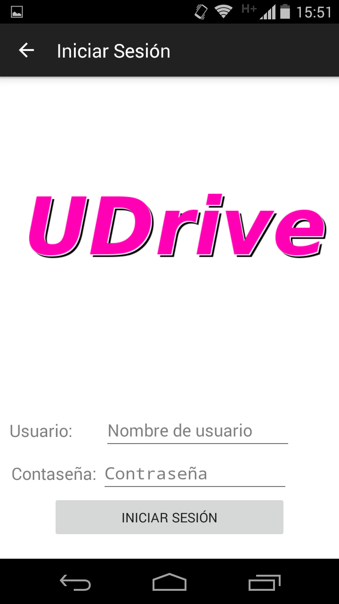
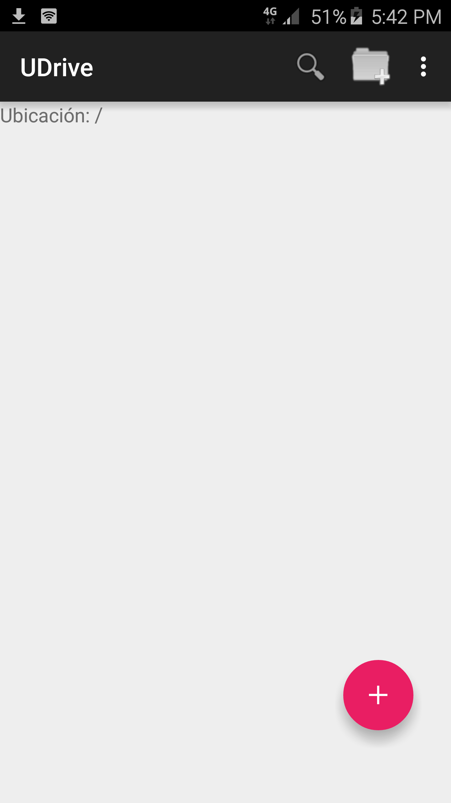

Inicio de sesión
==========================================

Pantalla de inicio
^^^^^^^^^^^^^^^^^^^^
Al iniciar la aplicación se encontrará con la siguiente ventana:

Allí, lo primero que debe hacer es ingresar la IP del servidor al cual quiere conectarse. Vale aclarar, que siempre será sobre el puerto 8080.

Registración
^^^^^^^^^^^^^^^^^
Para registrar un usuario, se debe ingresar al menú correspondiente:

En este menú se deben ingresar los campos que aparecen en la imagen. Algunas aclaraciones:

 * El nombre del usuario debe contener sólo letras y números.
 * La contraseña debe contener al menos 8 caracteres.
 * El mail debe contener al menos un @ y un . después del mismo. Además, no puede contener un . antes del @.

 Si el proceso finalizó con éxito será dirigido a la pantalla inicial de la aplicación.

Inicio de sesión
^^^^^^^^^^^^^^^^^^
Si ya se tiene un usuario registrado, se puede ingresar simplemente al mismo mediante el nombre de usuario y su contraseña registrado previamente:

Si el proceso finalizó con éxito será dirigido a la pantalla inicial de la aplicación.

Sesión iniciada
^^^^^^^^^^^^^^^^^^
Una vez iniciada la sesión, llegará a la siguiente pantalla, donde podrá comenzar a utilizar la aplicación **UDrive**.

