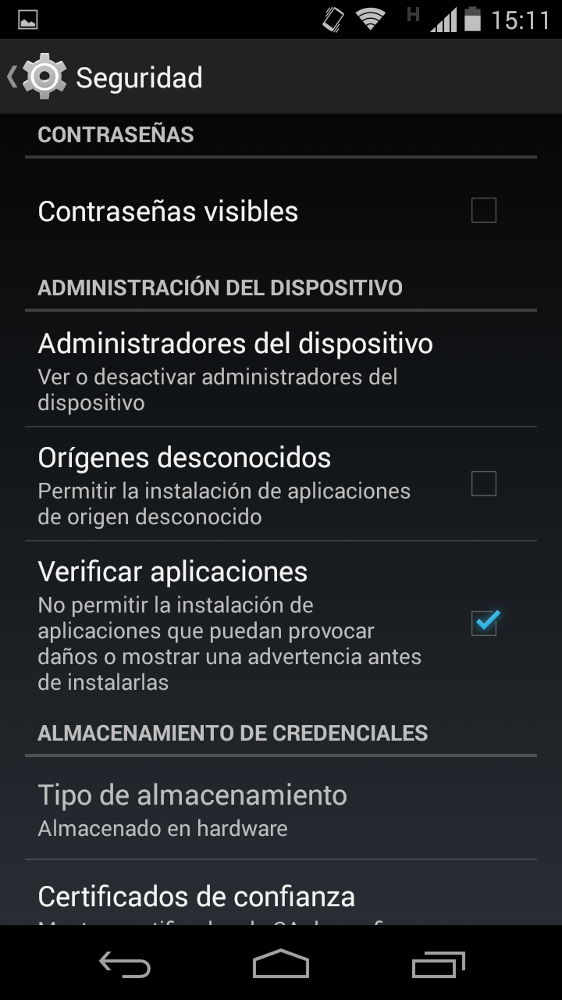
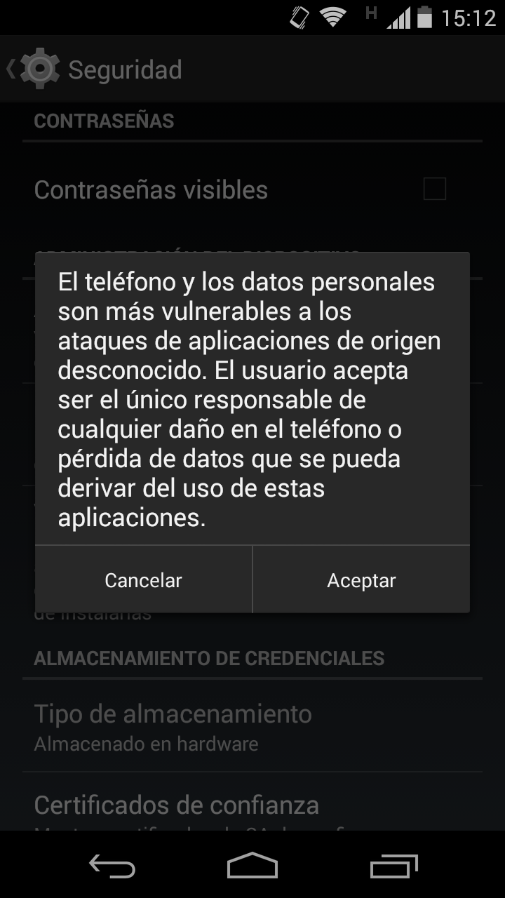
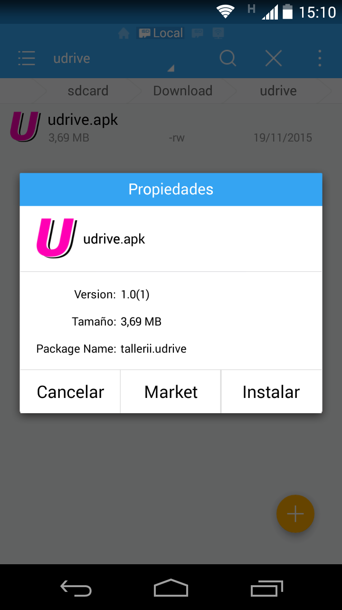
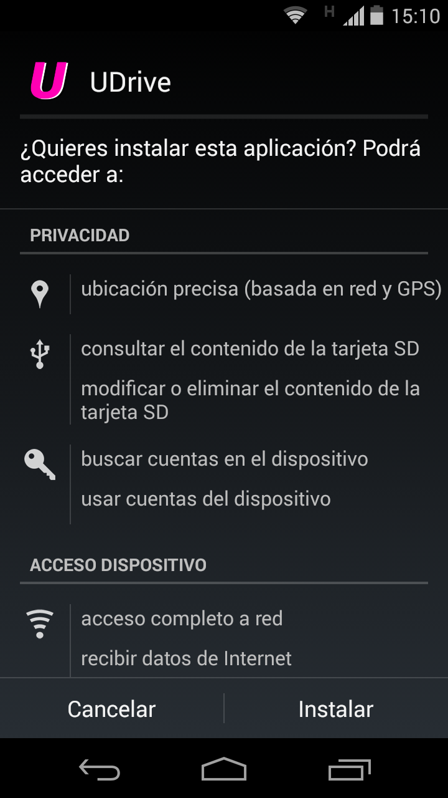

Instalación
==========================================

La aplicación **UDrive** es simple y sencilla de instalar. Sólo basta con seguir los siguientes pasos:

1. Lo primero a hacer es habilitar la instalación de aplicaciones de origen desconocido. Para ello se debe acceder a Ajustes>Seguridad:

2. Luego se debe aceptar para que esta acción tome efecto:

3. Teniendo descargado el archivo udrive.apk en el celular, desde algún administrador de archivos acceder a dicha ubicación y seleccionar el archivo:

4. Seleccione "Instalar":

5. Aguarde mientras se instala la aplicación:

.. figure:: _static/instalacion/5.png
	:scale: 40
	:align: center

6. Finalmente, usted habrá instalado satisfactoriamente la aplicación en su teléfono celular:

