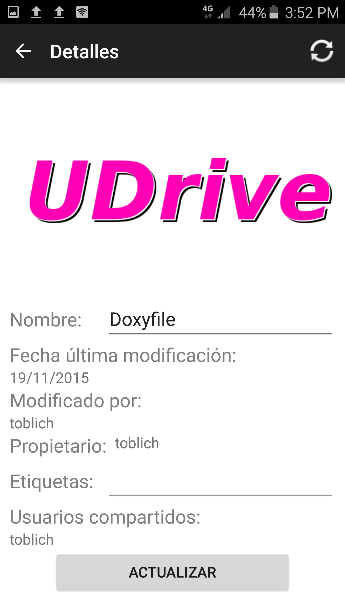
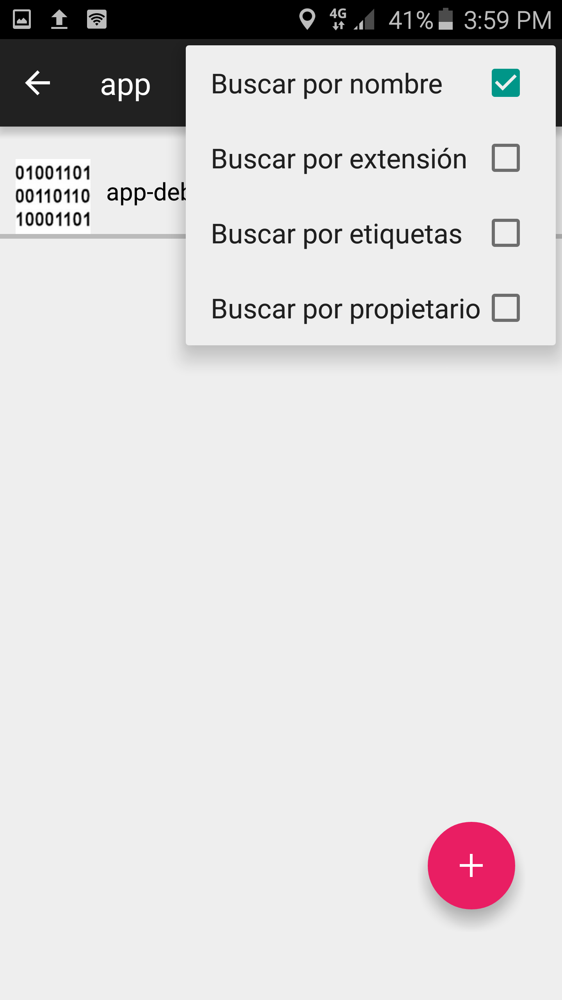

Metadatos y Búsquedas
==========================================

Metadatos
<<<<<<<<<<
Cuando se suben archivos a **UDrive** ésta ofrece la posibilidad de ver los metadatos de los mismos. Estos metadatos, tal como se puede ver en la imagen a continuación, pueden ser:

 + Nombre del archivo.
 + Fecha de última modificación.
 + Usuario que realizó la última modificación.
 + El propiertario del archivo.
 + La lista de etiquetas que tiene el archivo.
 + La lista de usuarios compartidos que tiene ese archivos.

Algunos de estos metadatos son modificables, como por ejemplo:

 + Se puede renombrar un archivo modificando el nombre del mismo.
 + Se pueden agregar una sola o una lista de etiquetas al archivo. Si se quiere agregar una lista las etiquetas deben tener un ";" entre si.
 + Para compartir el archivo con mas usuarios ir a la sección `Compartidos <compartidos.html>`_

Luego de modificar alguno de estos campos hay que seleccionar el botón de *Actualizar*.

Búsquedas sobre metadatos
<<<<<<<<<<<<<<<<<<<<<<<<<<<
Otra de las funcionalidades que ofrece la aplicación es la búsquedas de archivos a partir de diferentes metadatos, por ejemplo:

 + Búsquedas por nombre de un archivo.
 + Búsquedas por extensión de un archivo.
 + Búsquedas por etiquetas de un archivo.
 + Búsquedas por propietario de algun archivo.

 Tal como se puede ver en la imagen solo se puede realizar de a un tipo de búsqueda a la vez.

