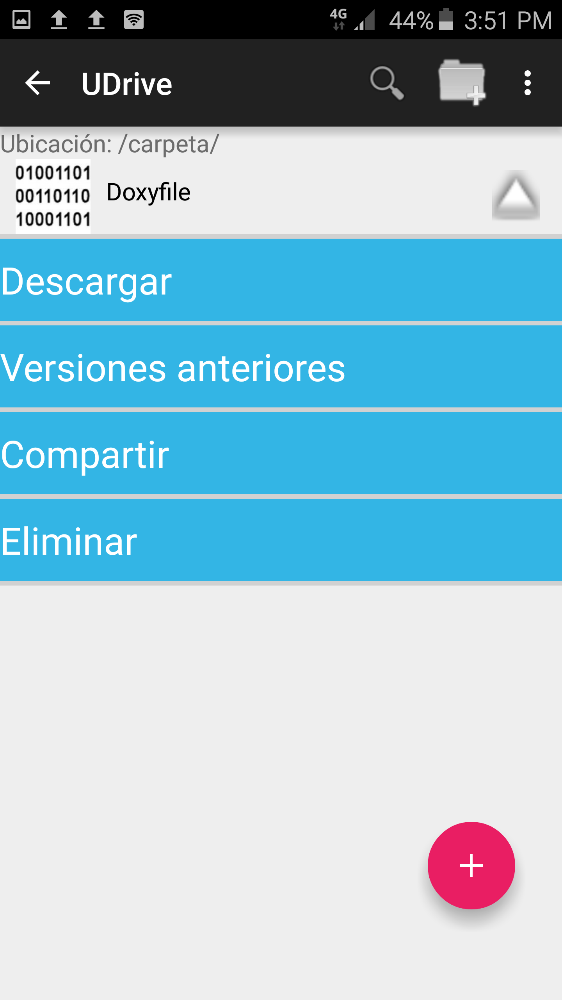
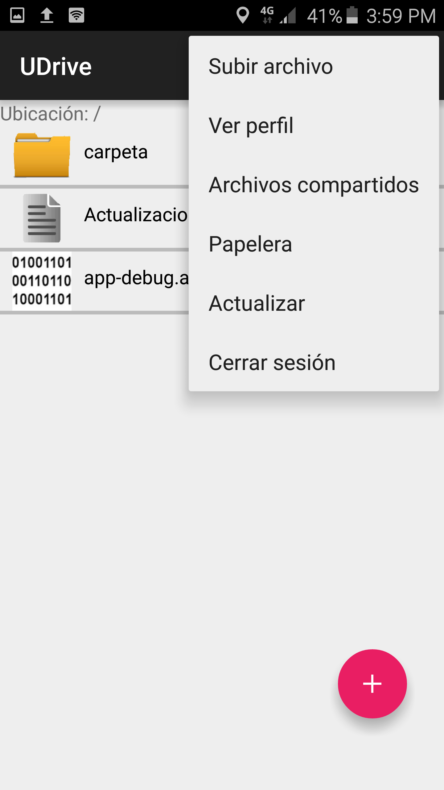
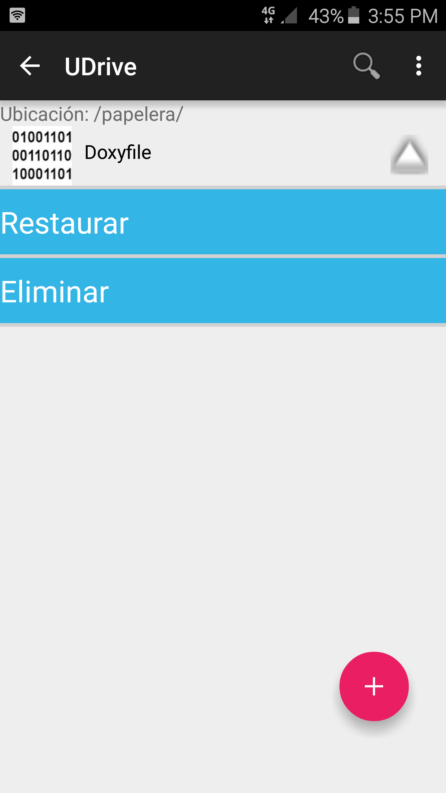

Papelera
==========================================

**UDrive** ofrece la funcionalidad de contar con una papelera para los archivos que han sido eliminados. Además, estos archivos eliminados pueden ser restaurados o eliminados definitivamente.

Para eliminar los archivos se tiene que abrir el menú de los mismos y seleccionar la opción *Eliminar*. Esto provocará que se envien a la papelera.

Para poder ir a la papelera hay que seleccionar la opción *Papelera* que aparece en el menú desplegable.

 
Una vez en la papelera, si se ingresa al menú del archivo, aparece la posibilidad de restaurarlo o eliminlarlo de definitivamente.

En el caso de que se haya eliminado alguna carpeta, ésta no aparecerá para poder ser restaurada o eliminada definitivamente, solo apareceran en la papelera los archivos que había dentro de ella. En el caso de que se restaure alguno de esos archivos la carpeta se restaurará automaticamente.