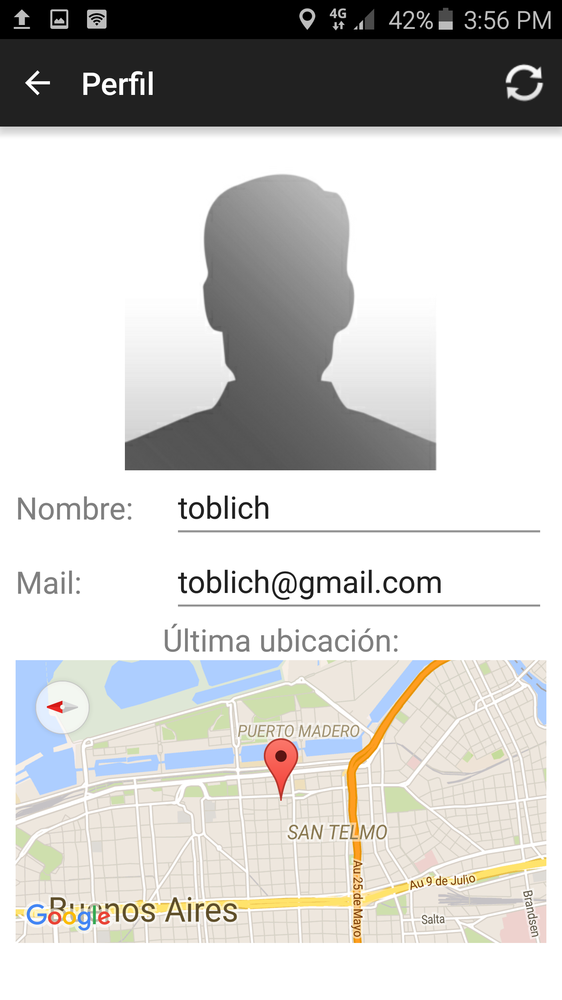
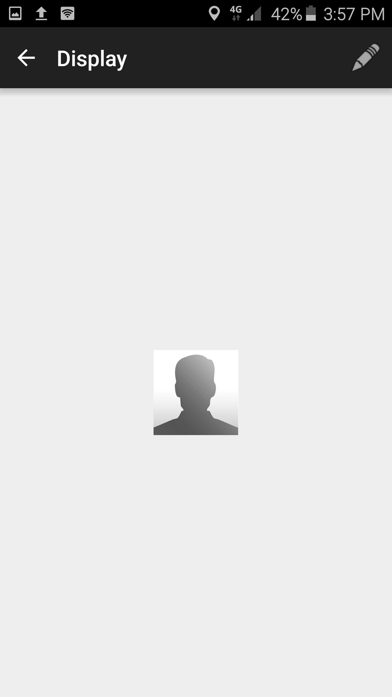
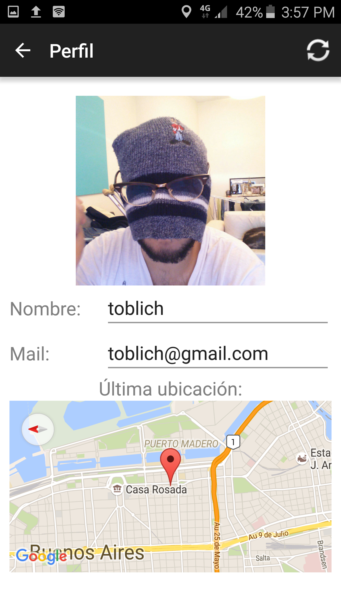
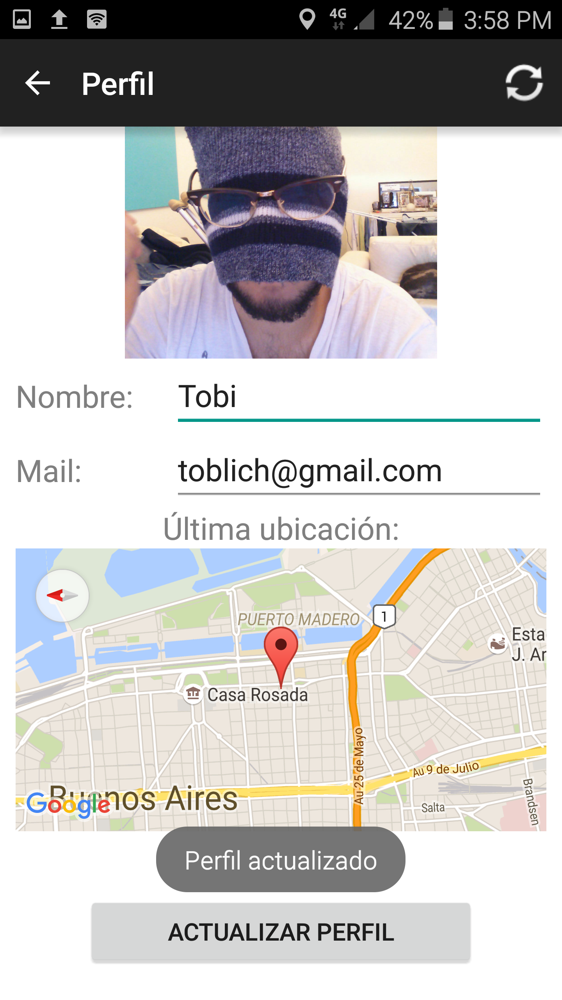

Perfil del usuario
==========================================
Usted puede ingresar a su perfil, seleccionando del menú desplegable de la parte superior derecha la opción "Ver perfil".

Cambiado de fotos
^^^^^^^^^^^^^^^^^^^^^^^
Una vez dentro del perfil, puede cambiar su foto de perfil. Originalmente, usted tendrá una foto por defecto. Le recomendamos cambiarla por una foto que lo represente. Esto puede hacerse tocando la foto. Cuando lo haga, la misma se agrandará:

Para cambiar su foto de perfil, puede seleccionar una foto, apretando el lápiz que se encuentra en la parte superior derecha de la pantalla. Una vez seleccionada la foto deseada, pulse el botón hacia atrás, y su foto quedará actualizada exitosamente.

Actualización de perfil
^^^^^^^^^^^^^^^^^^^^^^^^^^
Dentro de la opción de "Ver perfil" mencionada anteriormente, usted puede modificar también su nombre y mail. El mail sigue teniendo las mismas restricciones que tenía al registrar un usuario. En cuanto al nombre, es importante remarcar que no es el nombre de usuario, sino su nombre real.

	Notar que se cambio el nombre de toblich a Tobi

Última ubicación
^^^^^^^^^^^^^^^^^^^^^
Si se tiene activado el GPS del celular, usted podrá ver la ubicación de donde realizó la última subida de un archivo.
